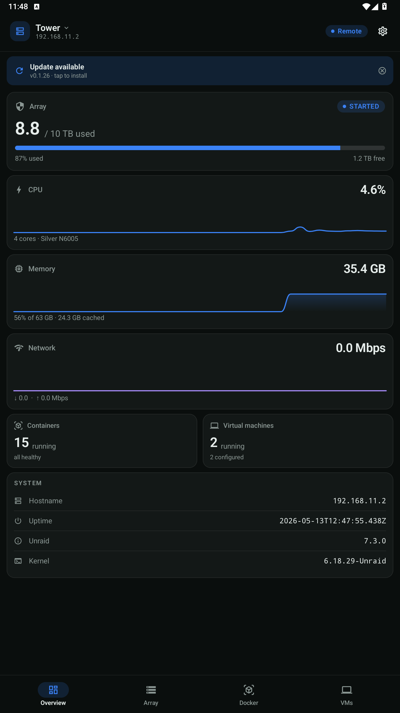
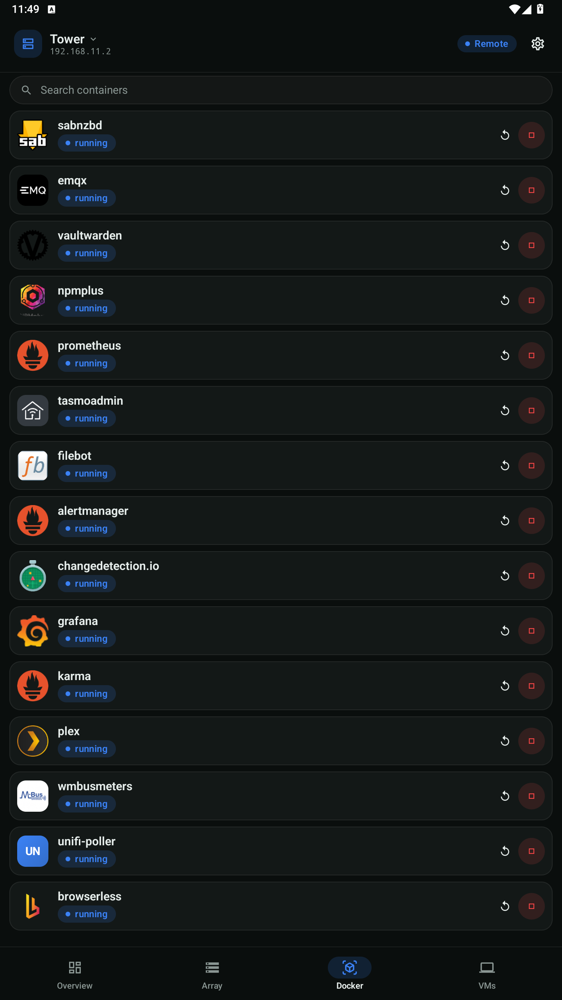
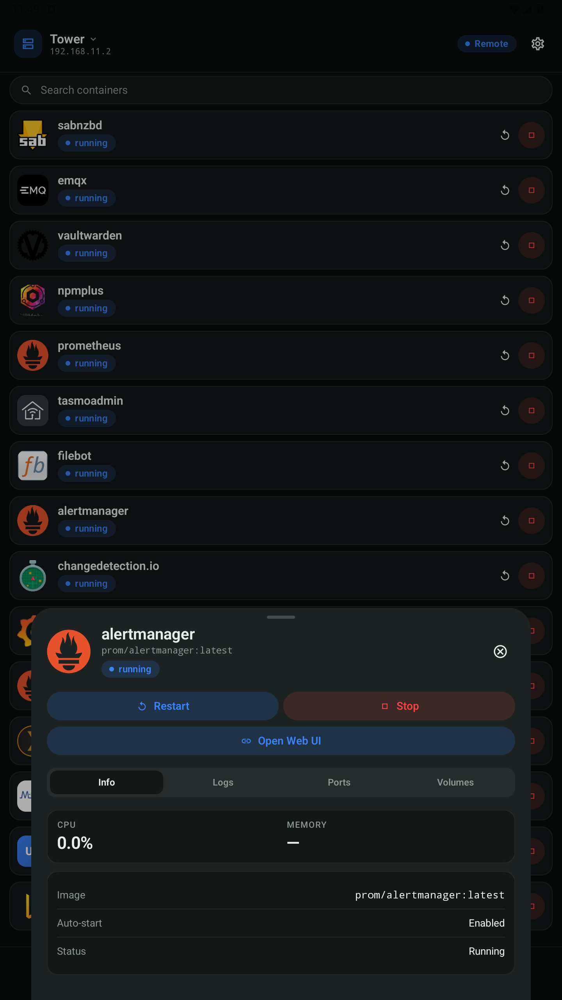
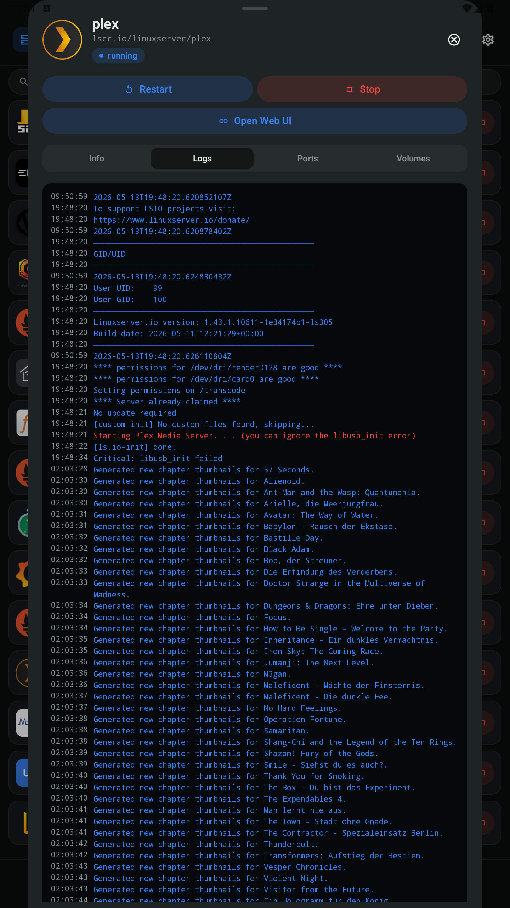
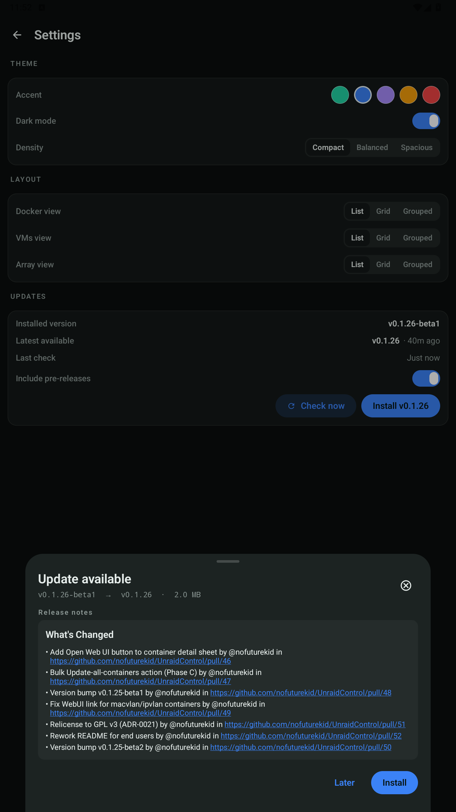

# NOVA — NAS Operations Viewer Anywhere

**NOVA for Unraid® — your NAS in your pocket. A fast, native Android app for keeping an eye on — and a hand on — your Unraid® server.**

_See the actual UI in your browser — sample data, no server needed (snapshot of the 0.1.31 cycle)._

---

NOVA puts the parts of your Unraid® server you actually check on your phone — array health, container and VM state, live system metrics — into a clean, dark, one-thumb interface. Start a container, fix a stuck VM, kick off an update, glance at parity progress: without opening a laptop or fighting the desktop web UI on a phone screen.

It talks to your server through the official Unraid API (the Connect plugin's GraphQL endpoint) over your own network — nothing is routed through any third party.

## Screenshots

**Live interactive preview (no install):** <https://nofuturekid.github.io/nova/> — a clickable prototype of the UI (snapshot of the 0.1.31 cycle; sample data, not a live server).

| Overview | Docker | Container detail |
|:---:|:---:|:---:|
|  |  |  |

| Container logs | Settings & changelog |
|:---:|:---:|
|  |  |

## What you can do

- **Overview** — array capacity, CPU & memory live, container/VM counts, parity-check progress at a glance
- **Array** — disk-by-disk status, temperatures, capacity, start/stop the array
- **Docker** — every container with status; start / stop / restart / pause, jump straight to a container's Web UI, see which have image updates and update one — or all — in a tap
- **VMs** — VM state with start / stop / pause / resume
- **Multiple servers** — switch between them; each remembers its own local and remote address
- **Stay current** — the app checks GitHub for its own updates and installs them in place

## What's not in yet

NOVA surfaces what Unraid's GraphQL API exposes today. A few things commonly asked for aren't there yet — most because the upstream API hasn't added them:

- **Plugin updates** — NOVA shows installed plugins and the install-job history, but Unraid's API doesn't expose "update available" status the way it does for Docker containers. Tracking: [unraid/api#2012](https://github.com/unraid/api/issues/2012).
- **Live NIC traffic** — NOVA shows the static network-interface inventory (IPs, MAC, link speed, vendor) and the primary interface, but RX/TX byte counters / bandwidth aren't exposed by the API yet. Tracking: [unraid/api#1602](https://github.com/unraid/api/issues/1602) (Lime Technology bounty) + the in-flight implementation at [unraid/api#2003](https://github.com/unraid/api/pull/2003).
- **User shares / SMB / NFS**, **UPS**, **disk SMART**, **parity-check scheduling** — not yet surfaced.

If something on this list (or off it) matters to you, an issue or a 👍 on an existing one is the best signal.

## Look & feel

A deliberately dark, glassy Material 3 design — dense cards, a single accent color, restrained motion. Tuned for quick checks, not for living in.

A few things bend to taste in **Settings**:

- **Accent** — mint, blue, purple, amber or red
- **Mode** — dark or light
- **Density** — compact, balanced or spacious padding
- **Docker layout** — list, grid or grouped-by-state

## Getting started

1. **Install** the latest APK from the [Releases page](https://github.com/nofuturekid/nova/releases). (Android will ask you to allow installing from your browser/files app — that's expected for apps outside the Play Store.)
2. On your Unraid server, generate an **API key**: web UI → _Settings → Management Access → API / Connect_.
3. Open the app → **Add server** and fill in:
   - **Name** — a label, e.g. `Tower`
   - **Local URL** — its address on your home network, e.g. `http://192.168.1.10`
   - **Remote URL** — optional, e.g. a Connect/remote address for when you're away
   - **API key** — the one you just generated
4. Tap **Test**, then **Save**. The pill in the top bar flips between **Local** and **Remote**.

Requires an Unraid 7.x server with the API/Connect plugin enabled.

## Trademark attribution

Unraid® is a registered trademark of Lime Technology, Inc. NOVA is an independent, community-built client; it uses the term solely to describe compatibility with the Unraid® operating system and is not affiliated with, endorsed by, or supported by Lime Technology. The project was previously named `UnraidControl`; the rename to NOVA in v0.1.33 was made to comply with the Unraid® Trademark Policy — see [ADR-0038](./docs/adr/0038-lime-trademark-compliance-rename-pending.md) and [ADR-0039](./docs/adr/0039-rename-to-nova.md).

## Privacy & data handling

- **Your API key stays on your device.** It's encrypted at rest using Android Keystore via Google's Tink library, and explicitly excluded from cloud backup / device-transfer.
- **No analytics, no telemetry, no third-party services.** The app talks only to your Unraid server's API and — when you press "Check now" in Settings — to GitHub's API to look for app updates.
- **Update downloads** go directly from GitHub Releases to your device over HTTPS. The downloaded APK is verified by byte-size match and constant-time SHA-256 against the published release asset before any install attempt; mismatch fails closed. See [ADR-0034](./docs/adr/0034-update-integrity-and-data-at-rest.md) for the rationale.
- **Source is the spec.** Audit, fork, run yourself — GPL v3.

## Contributing & internals

Architecture, the release pipeline, the GraphQL mapping, and design decisions live in [`CONTRIBUTING.md`](./CONTRIBUTING.md) and the Architecture Decision Records under [`docs/adr/`](./docs/adr/). Bug reports and PRs welcome.

Before pushing, you can run the exact CI checks locally in a pinned container with `./scripts/local-ci.sh` — see [`docs/local-build.md`](./docs/local-build.md).

## License

GNU General Public License v3.0. Use it (including commercially), modify it, run it — but if you distribute the app or a fork, the corresponding source has to be available under the same license. Full text in [`LICENSE`](./LICENSE); rationale in [ADR-0021](./docs/adr/0021-relicense-to-gpl-3.md).

© 2026 nofuturekid
